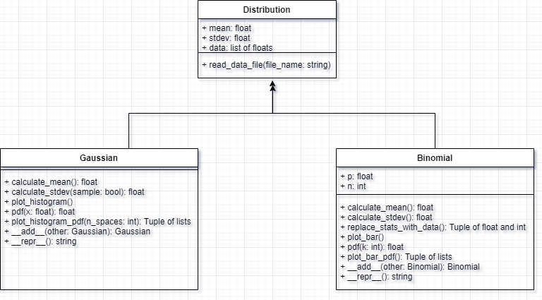

#  Udacity_Gaussian

## Overview

This project is a part of *Introduction to Object-Oriented Programming* course - [Udacity](https://www.udacity.com/).

The course is not available at the moment and was a part of *AWS Machine Learning Foundations Course*. 

This is a package that contains code to analyze Gaussian and Binomial distributions.

The package can:

- Read in a dataset,
- Calculate the mean,
- Calculate the standard deviation,
- Plot a histogram of the dataset,
- Plot probability density function of Gaussian and Binomial distributions,
- Add two Gaussian distributions.
- Add two Binomial distributions.

The project consists of a base class (Distribution) and two child classes (Gaussian, Binomial). The class diagram is as follows:

Class Diagram

## Install

pip install distributions-EH

## Usage

